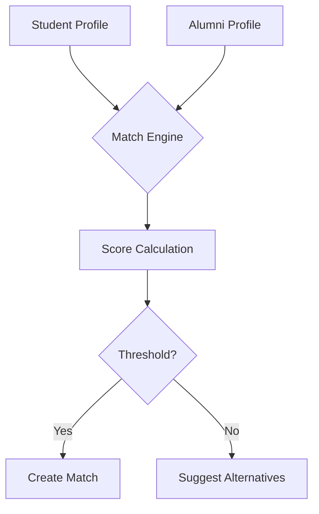

# 🎓 Alumni‑Student Connection Platform

## Table of Contents
- [Overview](#overview)
- [Problem Statement](#problem-statement)
- [Desired Outcomes](#desired-outcomes)
- [Scope & Features](#scope--features)
- [Stakeholder Matrix](#stakeholder-matrix)
- [Matching Algorithm](#matching-algorithm)
- [Architecture Overview](#architecture-overview)
- [Future Enhancements](#future-enhancements)

---

## Overview

This document outlines the core problem that **AlumniHub** solves: bridging the gap between alumni and current students to enable mentorship, networking, and knowledge sharing. The platform acts as a **central hub** where both groups can connect based on interests, expertise, and availability.

---

## Problem Statement

> [!WARNING] **Current Pain Points**
> - **Lack of Structured Mentorship:** Students struggle to find mentors with relevant industry experience.
> - **Disconnected Alumni Networks:** Alumni lose touch with their alma mater and miss opportunities to give back.
> - **Information Silos:** Career advice, internship leads, and industry insights are scattered across informal channels (social media, personal messages, etc.).

---

## Desired Outcomes

> [!TIP] **What We Aim to Achieve**
> - **Centralized Platform** for alumni to register expertise and availability.
> - **Searchable Mentor Directory** allowing students to filter by field, graduation year, location, and skill set.
> - **Integrated Communication Tools** (chat, video calls) and **resource‑sharing** capabilities.
> - **Progress Tracking** for mentorship requests, feedback loops, and outcome metrics.

---

## Scope & Features

1. **User Registration & Profiles**
   - Alumni: professional experience, industries, availability, mentorship interests.
   - Students: academic background, career goals, preferred mentorship topics.
2. **Matching Engine**
   - Attribute‑based scoring (skills, interests, availability).
   - Manual override & recommendation suggestions.
3. **Dashboard**
   - Request management, upcoming sessions, feedback forms.
4. **Communication Suite**
   - Real‑time chat, scheduled video calls (via embedded Jitsi/Zoom links).
5. **Resource Library**
   - Uploadable documents, links, and curated articles.

---

## Stakeholder Matrix

| Role      | Primary Needs                               | Platform Benefits |
|-----------|--------------------------------------------|-------------------|
| Alumni    | Share expertise, give back, network       | Visibility, mentorship credits |
| Students  | Find mentors, career guidance, opportunities | Tailored matches, direct contact |
| Admins    | Manage users, monitor activity, ensure compliance | Analytics, moderation tools |

---

## Matching Algorithm

**Scoring Factors**
- **Skill Overlap** (30%)
- **Industry Alignment** (25%)
- **Availability Window** (20%)
- **Geographic Proximity** (15%)
- **Mentorship Preference** (10%)

Matches are ranked and the top‑3 are presented to the student for acceptance.

---

## Architecture Overview

> [!NOTE] **High‑Level Components**
> - **Frontend**: React + Vite, responsive UI with dark‑mode support.
> - **Backend**: Node.js (Express) API, PostgreSQL for persistence, Redis for caching match scores.
> - **Auth**: OAuth2 (Google) + JWT.
> - **Realtime**: Socket.io for chat, WebRTC for video calls.

---

## Future Enhancements

- **AI‑Powered Recommendations** using language models to suggest mentors based on free‑text queries.
- **Gamification**: Badges and points for alumni mentors.
- **Mobile App**: Native iOS/Android clients for on‑the‑go access.

---

*This document serves as a comprehensive foundation for further design specifications and implementation planning.*

## Overview

This document outlines the core problem that **AlumniHub** aims to solve: bridging the gap between alumni and current students to facilitate mentorship, networking, and knowledge sharing.

## Problem Statement

- **Lack of Structured Mentorship:** Students often struggle to find mentors who have relevant industry experience.
- **Disconnected Alumni Networks:** Alumni lose touch with their alma mater and miss opportunities to give back.
- **Information Silos:** Valuable career advice, internship opportunities, and industry insights are scattered across informal channels.

## Desired Outcomes

- Create a **centralized platform** where alumni can register their expertise and availability.
- Enable students to **search and request mentorship** based on specific criteria (e.g., field, graduation year).
- Provide **communication tools** (chat, video calls) and **resource sharing** capabilities.

## Scope

- User registration and profile management for both alumni and students.
- Matching algorithm based on interests, skills, and availability.
- Dashboard for managing mentorship requests and tracking progress.

---

*This file serves as a starting point for further elaboration and design specifications.*
